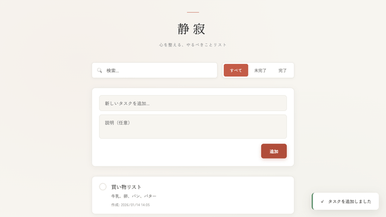
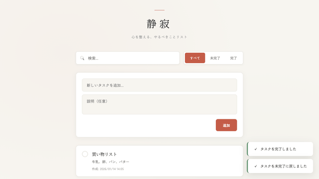
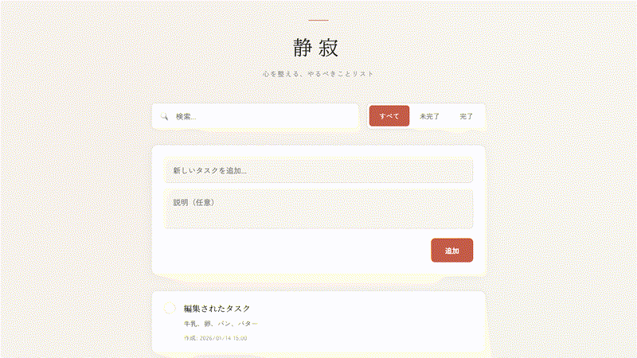

# browser-viz-skill テスト結果サンプル

agent-browserを使用したブラウザ自動化テストのための視覚化ツールキット。GIF録画、スクリーンショット、アノテーション（赤枠ハイライト、ズーム）機能を提供します。

---

## 概要

browser-viz-skillは、ブラウザ自動化テストの結果を視覚的にドキュメント化するためのツールです。以下の機能を提供します：

| 機能 | 説明 |
|------|------|
| GIF録画 | テスト操作フローをアニメーションGIFとして記録 |
| スクリーンショット | 各ステップの画面キャプチャ |
| 赤枠ハイライト | 注目要素に赤い枠線を追加 |
| ズーム | 特定領域を拡大表示 |

---

## Prerequisites

- [agent-browser](https://github.com/vercel-labs/agent-browser) がインストールされていること
- ffmpegがインストールされていること（`brew install ffmpeg`）
- Node.js 18+
- sharp（画像処理ライブラリ）

---

## テスト結果サンプル

以下はtodo-appに対して実行したテストの結果です。

### 1. タスク追加テスト

新しいタスクを追加する操作フローのテスト。



**テストステップ：**
1. 初期状態をキャプチャ
2. タイトル入力欄をクリック
3. タスクタイトルを入力（赤枠ハイライト付き）
4. 説明を入力
5. 追加ボタンをホバー（赤枠ハイライト付き）
6. 追加ボタンをクリック
7. 結果を確認

### 2. タスク完了トグルテスト

タスクの完了状態を切り替える操作のテスト。



**テストステップ：**
1. 初期状態（未完了タスク）
2. チェックボックスをハイライト
3. クリックして完了状態に変更
4. 結果を確認（ハイライト付き）
5. 再度クリックして未完了に戻す

### 3. タスク編集テスト

タスクを編集する操作のテスト。


**テストステップ：**
1. 編集ボタンをハイライト
2. 編集ボタンをクリック
3. モーダルを確認（ハイライト付き）
4. タイトルを編集
5. 保存ボタンをクリック
6. 結果を確認

### 4. タスク削除テスト

タスクを削除する操作のテスト。



**テストステップ：**
1. 削除ボタンをハイライト
2. 削除ボタンをクリック
3. 確認モーダルを表示（ハイライト付き）
4. 削除を確定
5. 結果を確認

### 5. フィルターテスト

タスクフィルター機能のテスト。


**テストステップ：**
1. フィルターボタンをハイライト
2. 「未完了」フィルターをクリック
3. 未完了タブを確認（ハイライト付き）
4. 「完了」フィルターをクリック
5. 「すべて」に戻る

### 6. 検索テスト

タスク検索機能のテスト。


**テストステップ：**
1. 検索ボックスをハイライト
2. 検索クエリを入力
3. 検索結果を確認（ハイライト付き）
4. 検索をクリア
5. 全件表示に戻る

---

## コード例

### 基本的なスクリーンショット

```javascript
async function screenshot(name, description = '') {
  frameCounter++;
  const paddedNum = String(frameCounter).padStart(3, '0');
  const filename = `${FRAMES_DIR}/${paddedNum}-${name}.png`;
  await agentBrowser('screenshot', [filename]);
  console.log(`📸 [${paddedNum}] ${description || name}`);
  return filename;
}
```

### 赤枠ハイライト付きスクリーンショット

```javascript
async function addHighlight(inputPath, box, outputPath) {
  const sharp = (await import('sharp')).default;
  const image = sharp(inputPath);
  const metadata = await image.metadata();

  const padding = 8;
  const x = Math.max(0, box.x - padding);
  const y = Math.max(0, box.y - padding);
  const width = Math.min(metadata.width - x, box.width + padding * 2);
  const height = Math.min(metadata.height - y, box.height + padding * 2);

  const svg = `
    <svg width="${metadata.width}" height="${metadata.height}">
      <rect x="${x}" y="${y}" width="${width}" height="${height}"
        fill="none" stroke="#FF0000" stroke-width="4" rx="6" ry="6"/>
    </svg>`;

  await image
    .composite([{ input: Buffer.from(svg), top: 0, left: 0 }])
    .toFile(outputPath);
}
```

### GIF生成

```javascript
async function generateGif(outputName, fps = 2) {
  const outputPath = `${OUTPUT_DIR}/${outputName}`;

  return new Promise((resolve, reject) => {
    const proc = spawn('ffmpeg', [
      '-y', '-framerate', String(fps),
      '-pattern_type', 'glob', '-i', `${FRAMES_DIR}/0*.png`,
      '-vf', `fps=${fps},scale=640:-1:flags=lanczos,split[s0][s1];[s0]palettegen[p];[s1][p]paletteuse`,
      '-loop', '0', outputPath
    ]);
    proc.on('close', (code) => {
      if (code === 0) resolve(outputPath);
      else reject(new Error(`ffmpeg failed`));
    });
  });
}
```

---

## ファイル構成

```
browser-viz-skill/
├── src/
│   ├── annotator.ts      # 画像アノテーション機能
│   ├── focus-detector.ts # 要素検出機能
│   └── types.ts          # 型定義
├── tests/
│   ├── test-add-task.mjs
│   ├── test-toggle-task.mjs
│   ├── test-edit-task.mjs
│   ├── test-delete-task.mjs
│   ├── test-filter.mjs
│   └── test-search.mjs
├── test-output/
│   ├── add-task.gif
│   ├── toggle-task.gif
│   ├── edit-task.gif
│   ├── delete-task.gif
│   ├── filter.gif
│   ├── search.gif
│   └── *-frames/         # 各テストのスクリーンショット
└── .claude/skills/
    └── browser-test-generator/
```

---

## 使用方法

### テストの実行

```bash
# 単一テストの実行
node tests/test-add-task.mjs

# 全テストの実行
for f in tests/*.mjs; do node "$f"; done
```

### 出力の確認

```bash
# GIFを開く
open test-output/add-task.gif

# スクリーンショットを確認
open test-output/add-task-frames/
```

---

## 注意事項

> **Warning**
> - チェックボックスなど一部の要素は`@ref`での参照が効かない場合があります。その場合はJavaScriptベースのクリック（`agent-browser eval`）を使用してください。
> - agent-browserのセッションは`open`コマンドごとにリセットされます。
> - GIF生成にはffmpegが必要です。

---

## 関連リンク

- [agent-browser](https://github.com/vercel-labs/agent-browser) - ブラウザ自動化CLI
- [sharp](https://sharp.pixelplumbing.com/) - 画像処理ライブラリ
- [ffmpeg](https://ffmpeg.org/) - 動画/GIF生成ツール
